>Informática II - G1 - 20/03/2026

**Integrantes:** 
- Johan Steven Guarnizo Posada
- Oscar David Gutierrez Hernandez
## 1. Contextualización
### 1.1 Descripción del desafío y objetivos del curso
El presente trabajo consiste en el desarrollo de un motor simplificado del juego Tetris, implementado en `C++` bajo el `framework Qt` y utilizando exclusivamente interfaz de consola. A diferencia del juego tradicional, esta versión opera por turnos: el sistema muestra el estado actual del tablero, solicita una acción al usuario y procesa el movimiento de la pieza actual.

Tal como se establece en el documento del desafío 1:

> “El objetivo principal de esta actividad es poner a prueba sus habilidades en el análisis de problemas y en el dominio del lenguaje C++. Si ha seguido un proceso disciplinado de aprendizaje a lo largo del semestre, esta es una excelente oportunidad para demostrarlo. Podrá proponer una solución efectiva y obtener un resultado satisfactorio"

De esta manera, el desafío busca evaluar de forma práctica el dominio de técnicas avanzadas de programación en `C++`, con énfasis en el uso eficiente de operadores a nivel de bits y la gestión de memoria dinámica.

---
### 1.2 Consideraciones del desarrollo
Teniendo en cuenta que las indicaciones para el desarrollo del desafío son:
- **Dimensiones:** El ancho y alto mínimo deben ser de 8 bloques
- **Validación:** Debe ser múltiplo de 8
- **Lógica basada en operaciones a nivel de `Bits`:**  Definir estructuras que permitan representar los elementos requeridos en la visualización.
- **Piezas:** Para el tetris, las piezas a representar serán | (1x4) , Cuadrado (2x2), T (3x2), S (3x2), Z (3x2), J (2x3), L (2x3)
---
### 1.3. Restricciones del desarrollo
Lo que se debía tener en cuenta para el desarrollo del desafío 1 según la guía propuesta era:
1. No se pueden usar objetos tipo `string`como parte de la solución.
2. La implementación debe incluir el uso de punteros, arreglos y memoria dinámica
3. En la implementación no se pueden usar estructuras, librerías no autorizadas, ni STL.
4. La solución debe ser planteada con `C++` en el `framework Qt-Creator` 
5. **Uso de operadores a nivel de bits:** Desplazamientos, colisiones, rotaciones, fijación de piezas, eliminación de filas y detección de `Game Over` 
6. Gestión eficiente de la memoria
7. **Lógica del juego:** Que funcione como el clásico juego de Tetris
---
## 2. Desarrollo
### 2.1 Arquitectura
Existen 8 archivos excluyendo el archivo principal `main.cpp`  donde cada uno de estos archivos tiene un rol muy especifico. Dichos archivos, están divididos en el `Headers` y `Sources` de la siguiente forma: `panel_control cpp/h`, `piezas cpp/h`, `movimiento cpp/h` y `fin_juego cpp/h`. 

Puede interpretarse que su uso esta en forma piramidal. Viéndolo de la siguiente forma:

1. ***Panel de control (`panel_control cpp/h`):*** Actúa como el archivo que gestiona de manera exclusiva la asignación y liberación de la memoria dinámica correspondiente al escenario (la matriz de `booleanos`). 
	- **Relación:** Al contener la ocupación del `tablero` y los límites espaciales `alto` y `ancho`, es importado por casi la totalidad de los demás archivos y al mismo tiempo para poder ejecutar correctamente`imprimir_tablero()`, el archivo depende de las variables globales que se encuentran en `piezas`, con el objetivo de calcular la posición de las piezas al inicio del tablero.


2. ***Piezas(`piezas cpp/h`):*** Donde se almacena, mediante arreglos estáticos de tipo `unsigned short`, la representación en hexadecimal de los siete figuras clásicas (en cuadrículas de 4x4).
	- **Relación:** Usa `panel_control.h` para interactuar con el tablero, detectar choques con `hay_colision()` y fijar la posición de la pieza cuando deja de caer `fijar_pieza` 


3. ***Movimiento(`movimiento cpp/h`):*** Es el encargado de procesar el movimiento de la ficha en curso, modificando sus coordenadas (`X, Y`) basándose en las entradas del teclado.
	- **Relación:** Se apoya en `piezas.h` para validar cada movimiento. Nunca cambia la posición de la pieza sin antes verificar con `hay_colision()` si el nuevo espacio está libre y dentro de los límites.


4. ***Fin del juego(`fin_juego cpp/h`):*** Se activa cada vez que una pieza termina de caer. Revisa si hay líneas completas para borrarlas y verifica si el jugador perdió.
	- **Relación:** Importa tanto `panel_control.h` como `piezas.h`. Usando `panel_control.h` para buscar filas llenas (todas en `true`) y borrarlas con `eliminar_filas_llenas()` y con `piezas.h` para detectar si una pieza nueva choca apenas aparece (en la posición `[0][0]`), lo que activa el fin del juego.


5. ***Programa principal:*** Al ser el archivo al que el copilador de `C++` busca en un principio, entonces incluye todos los `.h` y organiza todo de forma correcta para configurar el tablero en memoria, carga las piezas y arranca el bucle de control.


Para comprender de mejor manera la escala piramidal del proceso que se sigue, entonces hemos dispuesto del siguiente diagrama de flujo:
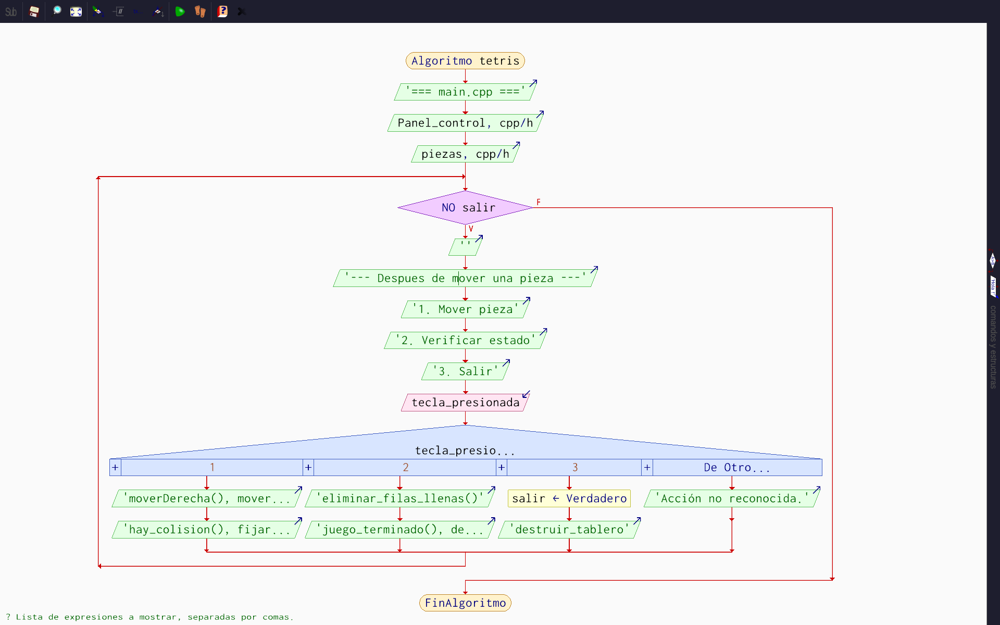

Donde el código de `Pseint` es:
```bash
Algoritmo tetris
	Escribir '=== main.cpp ==='
	Escribir Panel_control cpp/h
	Escribir piezas cpp/h
	Mientras  NO salir Hacer
		Escribir ''
		Escribir '--- Despues de mover una pieza ---'
		Escribir '1. Mover pieza'
		Escribir '2. Verificar estado'
		Escribir '3. Salir'
		Leer tecla_presionada
		Según tecla_presionada Hacer
			1:
				Escribir "moverDerecha(), moverIzquierda(), moverAbajo()"
				Escribir "hay_colision(), fijar_pieza()"
			2:
				Escribir "eliminar_filas_llenas()"
				Escribir "juego_terminado(), destruir_tablero()"
			3:
				salir <- Verdadero
				Escribir "destruir_tablero"
			De Otro Modo:
				Escribir 'Acción no reconocida.'
		FinSegún
	FinMientras
FinAlgoritmo

// --- MÓDULOS DEL SISTEMA ---
Función Movimiento_CalcularColisiones
	Escribir '[movimiento.cpp] -> Calculando movimiento...'
	Escribir '   -> Realizando consulta posicional...'
	Piezas_BitwiseDeteccion()
FinFunción

Función FinJuego_EvaluarEstado
	Escribir '[fin_juego.cpp] -> Ejecutando limpieza de fila y Game Over...'
	Escribir '   -> Inspeccionando primera superposición de piezas...'
	Piezas_BitwiseDeteccion()
	Escribir '   -> Reestructurando punteros en el panel...'
	PanelControl_GestionarRenderizado()
FinFunción

Función Piezas_BitwiseDeteccion
	Escribir '[piezas.cpp] -> Ejecutando lógica Bitwise...'
	Escribir '   -> Verificando límites físicos y grabando estado...'
	PanelControl_GestionarRenderizado()
FinFunción

Función PanelControl_GestionarRenderizado
	Escribir '[panel_control.cpp] -> Gestionando datos del tablero...'
	Escribir '   -> Leyendo bits del objeto para renderizar...'
FinFunción

Función PanelControl_ReservarDimensiones
	Escribir '[panel_control.cpp] -> Reservando dimensiones del tablero...'
FinFunción

Función Piezas_ReclamarInstancia
	Escribir '[piezas.cpp] -> Reclamando nueva instancia de la pieza...'
FinFunción
```
---
### 2.2 Descripción archivos

***`panel_control.cpp/h`*** 
Este archivo contiene la lógica para la administración espacial y visual del juego, gestionando de forma manual el almacenamiento de las dimensiones del tablero según lo ingresado por el usuario.

- `validar_dimensiones` captura el `ancho` y `alto` por consola y exige (mediante bucles `while`) que los valores sean mayores u iguales a 8 y estrictamente múltiplos de 8 (utilizando operador módulo `%`). Tras la validación, efectúa la reserva en el _`Heap`_ del bloque dinámico asignándolo a un puntero doble `bool** tablero`.
```cpp
void validar_dimensiones() {
  // Pedir el ancho del tablero, que segun la guia deben ser multiplos de 8
  cout << "Ingrese el ancho del tablero (minimo 8, multiplo de 8): ";
  cin >> ancho;
  while (ancho < 8 || ancho % 8 != 0) {
    cout << "Invalido. Debe ser multiplo de 8: ";
    cin >> ancho;
  }
  
  // Lo mismo pero con la altura
  cout << "Ingrese el alto del tablero (minimo 8, multiplo de 8): ";
  cin >> alto;
  while (alto < 8 || alto % 8 != 0) {
    cout << "Invalido. Debe ser multiplo de 8: ";
    cin >> alto;
  }
  
  // Crear el tablero con un puntero por cada fila
  tablero = new bool *[alto];
  for (int fila = 0; fila < alto; fila++) {
    tablero[fila] = new bool[ancho]; // cada fila tiene 'ancho' celdas
    for (int columna = 0; columna < ancho; columna++) {
      tablero[fila][columna] = false;
    }
  }

  cout << "Tablero de " << ancho << " x " << alto << " creado.\n";
}
```

- `imprimir_tablero` Recorre celda por celda. Usando el operador AND a nivel de bit (`&`) para superponer la `pieza_actual` sobre el `tablero` en tiempo real. Aquellas celdas ocupadas en memoria o superpuestas temporalmente por la ficha activa se imprimen mediante el carácter `#`; las celdas vacías con el carácter `.`
```cpp
void imprimir_tablero() {
  for (int fila = 0; fila < alto; fila++) {
    for (int columna = 0; columna < ancho; columna++) {

      // Verificar si la pieza activa ocupa esta celda
      int fila_relativa = fila - pieza_fila;
      int columna_relativa = columna - pieza_col;
      bool en_pieza = (fila_relativa >= 0 && fila_relativa < 4 && columna_relativa >= 0 && columna_relativa < 4) &&
                      (pieza_actual & (1 << (15 - (fila_relativa * 4 + columna_relativa))));

      if (tablero[fila][columna] || en_pieza)
        cout << '#';
      else
        cout << '.';
    }
    cout << '\n';
  }
}
```

- `destruir_tablero()` este lo hemos diseñado para liberar la memoria reservada con `delete[]` e impedir fugas de memoria.
```cpp
void destruir_tablero() {
  if (tablero != nullptr) {
    for (int fila = 0; fila < alto; fila++) {
      delete[] tablero[fila]; // liberar cada fila
    }
    delete[] tablero; // liberar el arreglo de punteros
    tablero = nullptr;
  }
}
```

***`piezas.cpp/h`***
Contiene los diseños de las piezas y el motor de colisiones. Se encarga de interpretar si una figura puede moverse o si ha impactado con otro bloque.

- `usingned short piezas[]` Las 7 figuras clásicas del tetris se almacenan como arreglos estáticos en base hexadecimal. Por ejemplo, `0x0F00` representa la barra ("I"), `0x0660` el cuadrado ("O") o también, `0x0720` que representa la (T). Al procesarse en binario, estos valores revelan internamente una distribución de espacios de 4x4 que da forma a cada figura.
```cpp
unsigned short piezas[] = {
    0x0F00, // I: 0000 1111 0000 0000
    0x0660, // O: 0000 0110 0110 0000
    0x0720, // T: 0000 0111 0010 0000
    0x0360, // S: 0000 0011 0110 0000
    0x0630, // Z: 0000 0110 0011 0000
    0x0710, // J: 0000 0111 0001 0000
    0x0740  // L: 0000 0111 0100 0000
};
```

- `hay_colision(usingned short pieza, int col, int fila)` esta función actúa como un filtro de seguridad antes de actualizar la posición de las fichas. Si la nueva posición toca un borde o una celda ocupada, el algoritmo devuelve `true` para detener el desplazamiento. Solo si ambas validaciones resultan negativas (es decir, no hay choque), se permite que las variables de posición de la pieza se actualicen en el juego.
```cpp
bool hay_colision(unsigned short pieza, int col, int fila) {
  for (int fila_local = 0; fila_local < 4; fila_local++) {
    for (int columna = 0; columna < 4; columna++) {
      if (pieza & (1 << (15 - (fila_local * 4 + columna)))) {
        int fila_tablero = fila + fila_local;
        int columna_tablero = col + columna;

        // Choca con borde izquierdo, derecho o fondo
        if (columna_tablero < 0 || columna_tablero >= ancho || fila_tablero >= alto)
          return true;

        // Choca con una celda ya ocupada del tablero
        if (fila_tablero >= 0 && tablero[fila_tablero][columna_tablero])
          return true;
      }
    }
  }
  return false;
}


```

- `fijar_pieza()` Al terminar de caer, transfiere los bloques de la pieza al tablero, es decir, fija la pieza actual en el tablero cuando deja de moverse, marcando sus posiciones como `true` 
```cpp
void fijar_pieza() {
  for (int fila_local = 0; fila_local < 4; fila_local++) {
    for (int columna = 0; columna < 4; columna++) {
      if (pieza_actual & (1 << (15 - (fila_local * 4 + columna)))) {
        int fila_tablero = pieza_fila + fila_local;
        int columna_tablero = pieza_col + columna;
        if (fila_tablero >= 0 && fila_tablero < alto && columna_tablero >= 0 && columna_tablero < ancho)
          tablero[fila_tablero][columna_tablero] = true; // marcar celda como ocupada
      }
    }
  }
}
```

- `nueva_pieza()` crea una nueva pieza en la posición `[0,0]` 
```cpp
void nueva_pieza(int indice) {
  pieza_actual = piezas[indice % 7];
  pieza_col = (ancho / 2) - 2; // Centrada
  pieza_fila = 0;              // EMpieza arriba
}
``` 

***`movimiento.cpp/h`*** gestiona el movimiento de las piezas de acuerdo a su posición en sus ejes `x`,`y` 
- **`moverIzquierda()` / `moverDerecha()` / `moverAbajo()`** Gestiona los cambios en `pieza_col` y `pieza_fila`. Cada movimiento depende de `hay_colision()`: si hay un choque, la posición se fija con `fijar_pieza()`.
```cpp
// Mueve la pieza una columna a la izquierda (tecla A)
unsigned short moverIzquierda(unsigned short pieza) {
  if (!hay_colision(pieza, pieza_col - 1, pieza_fila))
    pieza_col--;
  return pieza;
}

// Mueve la pieza una columna a la derecha (tecla D)
unsigned short moverDerecha(unsigned short pieza) {
  if (!hay_colision(pieza, pieza_col + 1, pieza_fila))
    pieza_col++;
  return pieza;
}

// Mueve la pieza una fila hacia abajo (tecla S)
unsigned short moverAbajo(unsigned short pieza) {
  if (!hay_colision(pieza, pieza_col, pieza_fila + 1))
    pieza_fila++;
  return pieza;
}

```

***`fin_juego.cpp/h`*** Su propósito es eliminar las filas completas del tablero y verificar el fin de la partida. Esto ocurre si se detecta una colisión en el punto de aparición justo al cargar una nueva pieza.

- `juego_terminado()` si el sistema reporta que la pieza tuvo una colisión en la posición inicial (`pieza_fila = 0`), define que el juego a terminado con `true`.
```cpp
// El juego termina cuando la nueva pieza que acaba de aparecer ya colisiona en
// su posicion inicial
bool juego_terminado() {
  return hay_colision(pieza_actual, pieza_col, pieza_fila);
}
```

- `eliminar_filas_llenas.cpp/h` escanea todo el tablero para identificar filas totalmente ocupadas. Cuando detecta una, desplaza todas las filas superiores para sobrescribir la fila llena, repitiendo el proceso hasta el tope del tablero para "bajar" todas las piezas.
```cpp
void eliminar_filas_llenas() {
  // Recorrer el tablero de abajo hacia arriba
  for (int fila = alto - 1; fila >= 0; fila--) {

    bool fila_llena = true;
    for (int columna = 0; columna < ancho; columna++) {
      if (!tablero[fila][columna]) { // si hay una celda libre, la fila no esta llena
        fila_llena = false;
        break;
      }
    }

    if (fila_llena) {
      for (int fila_desplazada = fila; fila_desplazada > 0; fila_desplazada--) {
        for (int columna = 0; columna < ancho; columna++) {
          tablero[fila_desplazada][columna] = tablero[fila_desplazada - 1][columna]; // copiar la fila de arriba
        }
      }
      // La fila 0 queda completamente vacia
      for (int columna = 0; columna < ancho; columna++) {
        tablero[0][columna] = false;
      }
      // Volver a revisar la misma fila 'fila' porque ahora tiene el contenido de
      // la de arriba
      fila++;
    }
  }
}
```

***`main.cpp`*** en el principal hemos puesto en la secuencia correcta todas las funciones para que el juego pudiera funcionar como lo teníamos previsto.
```cpp
int main() {

  validar_dimensiones();

  int indice = 0;
  nueva_pieza(indice); // Nueva pieza

  cout << "\nControles: A = izquierda  D = derecha  S = bajar  Q = salir\n\n";
  imprimir_tablero();

  char tecla;
  while (true) {
    cout << "Tecla: ";
    cin >> tecla;

    int fila_antes = pieza_fila; // guardar posicion antes de mover

    switch (tecla) {
    case 'a':
    case 'A':
      moverIzquierda(pieza_actual);
      break;
    case 'd':
    case 'D':
      moverDerecha(pieza_actual);
      break;
    case 's':
    case 'S':
      moverAbajo(pieza_actual);
      if (pieza_fila == fila_antes) {
        fijar_pieza();
        eliminar_filas_llenas(); // eliminar filas completas antes de la
        indice++; // siguiente pieza
        nueva_pieza(indice);
        cout << "[Nueva pieza!]\n";
        if (juego_terminado()) {
          destruir_tablero();
          cout << "\n=== FIN DEL JUEGO ===\n"; // Si termino
          return 0;
        }
      }
      break;
    case 'q':
    case 'Q':
      cout << "Saliendo...\n";
      destruir_tablero();
      return 0;
    default:
      cout << "Tecla no reconocida.\n";
      continue;
    }

    imprimir_tablero();
  }

  destruir_tablero();
  return 0;
}
```
---
## 3. Pruebas de ejecución

### 3.1 Pruebas de generación inicial del tablero
Luego de ejecutar el programa, la salida en consola es:
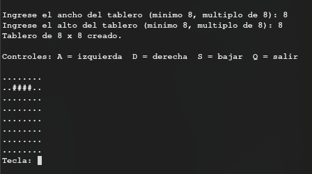
Después de solicitar las dimensiones del tablero y verificar que efectivamente sean múltiplos de 8, entonces, imprime el tablero y carga la primera pieza. Para comprobar que efectivamente verifique los números ingresados sean múltiplos de 8, realizamos la siguientes prueba:

**Prueba 1:**
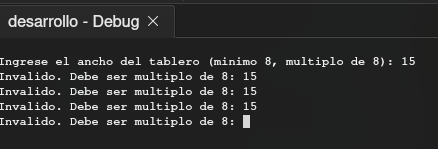

**Prueba 2:**
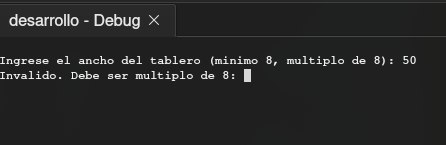
**Prueba 3:**
Mientras que, si ingresamos los múltiplos de 8
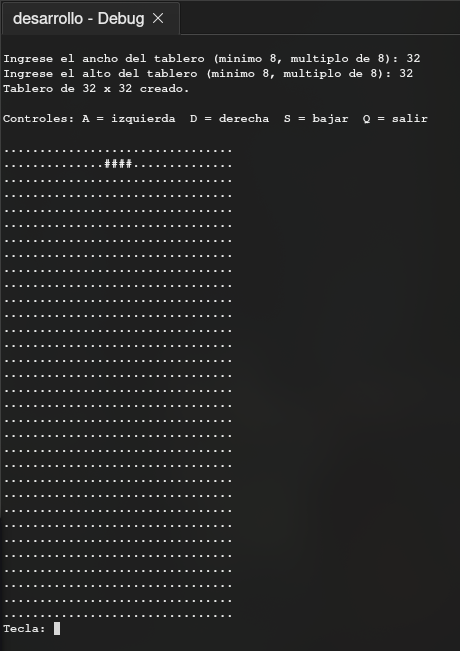
Efectivamente, imprime e tablero sin errores.

---
### 3.2 Pruebas de movimiento
Para verificar que las piezas efectivamente se muevan en el orden planeado y detecten las colisiones, entonces

***Movimiento:***
**Prueba 1:**
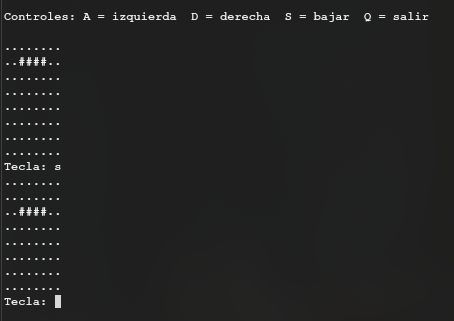
luego de presionar `s` se movió un espacio hacia abajo y, al mismo tiempo, tras presionar `S` se movió de la misma manera
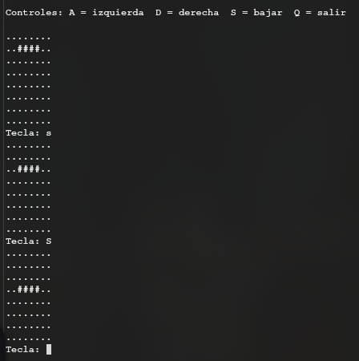

**Prueba 2:**
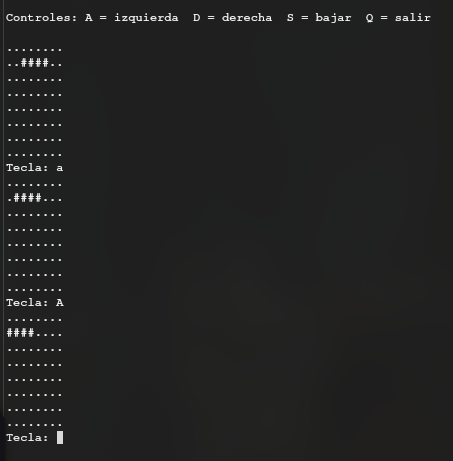
De la misma forma, al presionar `a` y `A` la pieza se mueve hacia la derecha

**Prueba 3:**
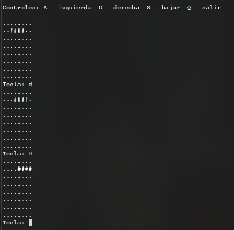
Por último, al presionar `d` y `D` se mueve hacia la derecha.

***Colisión:***
**Prueba 1:**
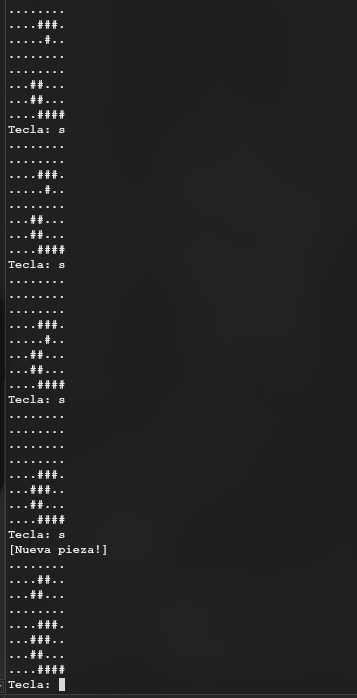
Tras una pieza chocar con otra, se queda en el lugar donde choco y inmediatamente, aparece la pieza siguiente que al momento de chocar, también se fija en el lugar del impacto.

---
### 3.3 Eliminación de filas y juego terminado
**Prueba de eliminación de fila:**
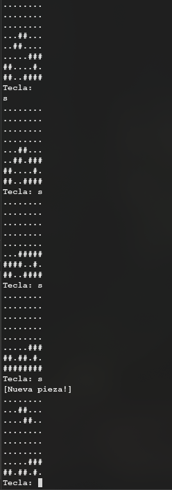
Observando que al llenarse la ultima fila, se elimino y paso la fila superior a sobrescribir la fila que se lleno.

**Prueba fin del juego:**
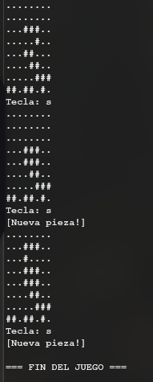
Una vez la nueva pieza cocho al crearse en la posición de inicio entonces el juego se dio por terminado.

## 4. Que hicimos y que no hicimos

| Característica                  | ¿Se cumplió? | Explicación sencilla                                                                                      |
| ------------------------------- | ------------ | --------------------------------------------------------------------------------------------------------- |
| **Tablero ajustable**           | **Sí**       | Pedimos el ancho y alto (múltiplos de 8) y usamos `new` para crear el espacio en memoria.                 |
| **Figuras**                     | **Sí**       | Creamos las 7 formas en hexadecimal (`0x0F00`)                                                            |
| **Tipo de tablero (`#` y `.`)** | **Sí**       | Se dibuja el tablero usando `#` para lo lleno y `.` para los espacios vacíos.                             |
| **Fin del juego**               | **Sí**       | El juego detecta cuando ya no hay espacio arriba al soltar una pieza nueva.                               |
| **Colisiones**                  | **Sí**       | Las figuras reconocen paredes y el suelo.                                                                 |
| **Piezas al azar**              | **No**       | Las piezas salen en orden (una tras otra) en lugar de ser aleatorias porque no supimos como hacerlo       |
| **Mover con Bits**              | **No**       | En lugar de `<<` o `>>`, usamos sumas y restas simples (`col++` y `col--`) porque se nos hacia más fácil. |
| **Fijar con OR (`\|`)**         | **No**       | En lugar de bits, guardamos la pieza celda por celda como `true` o `false`.                               |
## 5. Conclusiones
- **La organización del código importa mucho:** Durante el desafío se presento la importancia de estructurar correctamente un proyecto en `C++` para no enredarnos con un montón de código revuelto entre si. Para evitar el caos entonces tuvimos que utilizar archivos `.h` y la palabra reservada de `extern` para hacer un uso más eficiente de las variables (como el tablero o las coordenadas de la pieza) entre los archivos sin que el compilador se vuelva loco creando copias variables extra habiendo ya variables que podían ser utilizadas.

- **Memoria dinámica:** No siempre podemos darle un tamaño fijo a las variables desde el principio, porque aveces, el tamaño que definimos no es suficiente y empiezan a haber errores. Usar el `new` y un doble puntero (`**`) para el tablero fue la única forma de lograr que el jugador pudiera elegir el ancho y el alto justo al empezar a jugar y a la vez, cumplir con los requisitos del desafío de utilizar memoria dinámica y punteros.

- **Nombres que se entiendan:** Nos dimos cuenta de que poner letras sueltas como `f` o `c` hace que uno no se pierda en el código después de dejarlo unos meros días. Cambiarlas por palabras completas como `fila` y `columna` nos salvó la vida y nos ayudó a no olvidar nuestro código después de unos días.

### 6. Desafíos encontrados

- **El enredo de los archivos y los errores raros:** Peleamos un montón con el compilador. Me salían errores de que la variable "no existía" o "estaba duplicada". Fue un reto mental entender que el compilador lee archivo por archivo, y que si no usaba correctamente el `extern` y los `#include`, los archivos no se comunicaban bien entre ellos.

- **Operaciones de bits:** Tratar de entender cómo extraer la forma de las piezas usando `<<` y comparando con el AND (`&`) fue un dolor de cabeza enorme. Nos confundíamos un montón al pensar en ceros y unos, y no entendía por qué no podía usar un simple `OR` o `XOR`. Fue tan duro que, para la lógica principal del tablero, preferí cambiar las operaciones de bits por variables normales (como una matriz de booleanos de verdadero/falso), porque intentar hacer todo el juego a nivel de bits era demasiado complicado y abstracto para nuestro nivel actual y con el objetivo de completar exitosamente las fechas de entrega entonces decidimos realizar ese cambio. Pero lógicamente incluyendo operaciones a nivel de bits, porque el desafío lo pedía si o si.

## 7. Referencias
***Videos:***
- https://youtu.be/bgfH_HB341M?si=Qy7LwwYeRB2vdRw1
- https://youtu.be/NBO3UXdccIs?si=OjTDSCE6vrV6ASkm
- https://youtu.be/kMGNd7G_b4A?si=onVFEhqRe6FyVBwO
- https://youtu.be/PGHvRp7RSmQ?si=rkVczK7mk44BCh6P
- https://youtu.be/5rS0hkOOIfI?si=VlliqFIYOqPlB_Mz
- https://youtu.be/wYboaB70-Zw?si=oIzanBkHORPVJgcp
- https://youtu.be/2PIZ0G0Hml4?si=nfOg-awGFTHBCWRA

**Foros:**
- https://www.reddit.com/r/technicalwriting/comments/113mh5p/technical_documentation_templatessamplesexamples/?tl=es Luego de bajar se encuentra el comentario de "[Pradeepa_Soma](https://www.reddit.com/user/Pradeepa_Soma/)"